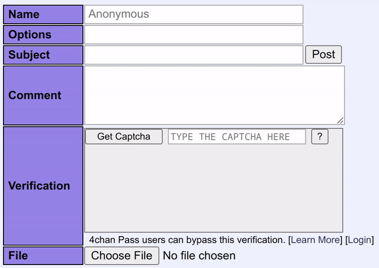

4chan-captcha-playground
========================
A project to train a machine learning model to solve the 4Chan CAPTCHA.

This project was entered into as a learning experience, to enhance my knowledge of machine learning, as well as TensorFlow specifically. At the end, I wanted to have a trained machine learning model that runs in the browser to reliably (at least 80% accuracy, >90% preferred) solve the 4Chan CAPTCHA. These goals were achieved.

A write-up with more detail on this project is available on my blog.

## Subprojects
More information on each project is available in that project's `README.md`.

### trainer
A Python project using OpenCV, TensorFlow, and Keras to process 4Chan CAPTCHA data and train the model. Also includes code to generate synthetic CAPTCHAs to augment the dataset.

### user-scripts
The user scripts that run in the browser to use the model and solve the CAPTCHAs as they are received.
